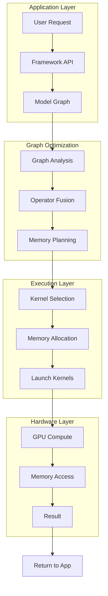

# AI Inference Pipeline

Visual representation of how a model inference request flows through the stack.

## High-Level Flow



## Detailed Request Flow

```
┌──────────────────────────────────────────────────────────────────────┐
│                          CLIENT APPLICATION                          │
│                                                                      │
│  1. Prepare input tensor       4. Receive output tensor              │
│  2. Call session.run()         5. Post-process result                │
│  3. Wait for completion                                              │
└─────────────────────────────────┬────────────────────────────────────┘
                                  │ API Call
                                  ▼
┌──────────────────────────────────────────────────────────────────────┐
│                         INFERENCE FRAMEWORK                          │
│                    (ONNX Runtime / PyTorch / TRT)                    │
│                                                                      │
│  ┌─────────────┐  ┌─────────────┐  ┌─────────────┐  ┌─────────────┐ │
│  │   Session   │  │    Graph    │  │   Memory    │  │   Kernel    │ │
│  │  Manager    │──│  Optimizer  │──│   Planner   │──│  Scheduler  │ │
│  └─────────────┘  └─────────────┘  └─────────────┘  └─────────────┘ │
│                                                                      │
│  - Load model           - Constant folding      - Allocate buffers  │
│  - Parse inputs         - Op fusion             - Schedule kernels  │
│  - Route to EP          - Shape inference       - Handle streams    │
└─────────────────────────────────┬────────────────────────────────────┘
                                  │ Operator Dispatch
                                  ▼
┌──────────────────────────────────────────────────────────────────────┐
│                         OPERATOR LIBRARIES                           │
│                    (MIOpen / cuDNN / rocBLAS)                        │
│                                                                      │
│  ┌─────────────────┐  ┌─────────────────┐  ┌─────────────────────┐  │
│  │  GEMM / MatMul  │  │   Convolution   │  │   Attention/Flash   │  │
│  │                 │  │                 │  │                     │  │
│  │  - Tiled impl   │  │  - Winograd     │  │  - Fused softmax    │  │
│  │  - Tensor cores │  │  - FFT          │  │  - Memory efficient │  │
│  │  - Auto-tuning  │  │  - Direct       │  │  - Multi-head       │  │
│  └─────────────────┘  └─────────────────┘  └─────────────────────┘  │
│                                                                      │
│  Provides: Best algorithm selection for given shapes/hardware       │
└─────────────────────────────────┬────────────────────────────────────┘
                                  │ Kernel Launch
                                  ▼
┌──────────────────────────────────────────────────────────────────────┐
│                         GPU RUNTIME                                  │
│                        (HIP / CUDA)                                  │
│                                                                      │
│  ┌────────────┐  ┌────────────┐  ┌────────────┐  ┌────────────────┐ │
│  │   Memory   │  │   Stream   │  │   Event    │  │    Kernel      │ │
│  │  Manager   │  │  Manager   │  │   Sync     │  │   Launcher     │ │
│  └────────────┘  └────────────┘  └────────────┘  └────────────────┘ │
│                                                                      │
│  - hipMalloc/cudaMalloc      - Async execution    - Grid/Block cfg  │
│  - hipMemcpy/cudaMemcpy      - Overlap compute    - Launch params   │
└─────────────────────────────────┬────────────────────────────────────┘
                                  │ Driver Calls
                                  ▼
┌──────────────────────────────────────────────────────────────────────┐
│                          GPU DRIVER                                  │
│                                                                      │
│  ┌──────────────┐  ┌──────────────┐  ┌──────────────┐               │
│  │   Command    │  │    Memory    │  │   Hardware   │               │
│  │   Queue      │  │   Mapping    │  │   Scheduler  │               │
│  └──────────────┘  └──────────────┘  └──────────────┘               │
│                                                                      │
│  - DMA transactions          - Page tables        - CU allocation   │
│  - ISA translation           - PCIe transfers     - Preemption      │
└─────────────────────────────────┬────────────────────────────────────┘
                                  │ Hardware Commands
                                  ▼
┌──────────────────────────────────────────────────────────────────────┐
│                            GPU HARDWARE                              │
│                                                                      │
│  ┌────────────────────────────────────────────────────────────────┐ │
│  │                    Compute Units (CUs)                         │ │
│  │  ┌────┐ ┌────┐ ┌────┐ ┌────┐ ┌────┐ ┌────┐ ┌────┐ ┌────┐     │ │
│  │  │ CU │ │ CU │ │ CU │ │ CU │ │ CU │ │ CU │ │ CU │ │ CU │ ... │ │
│  │  └────┘ └────┘ └────┘ └────┘ └────┘ └────┘ └────┘ └────┘     │ │
│  └────────────────────────────────────────────────────────────────┘ │
│                              │                                       │
│  ┌─────────────┐      ┌─────┴─────┐      ┌─────────────┐            │
│  │  L2 Cache   │◄────►│  Memory   │◄────►│    HBM/     │            │
│  │  (shared)   │      │Controller │      │   GDDR      │            │
│  └─────────────┘      └───────────┘      └─────────────┘            │
│                                                                      │
│  Execution: SIMT, warp/wavefront scheduling, register files         │
└──────────────────────────────────────────────────────────────────────┘
```

## Latency Breakdown Example

For a typical LLM inference (single token):

```
Component               Time (μs)    Percentage
─────────────────────────────────────────────────
API overhead            ~10          0.5%
Graph optimization      0 (cached)   0%
Memory allocation       ~50          2.5%
Host→Device transfer    ~100         5%
Kernel execution        ~1600        80%
  - Attention           ~800
  - FFN                 ~600
  - Other               ~200
Device→Host transfer    ~40          2%
Post-processing         ~200         10%
─────────────────────────────────────────────────
TOTAL                   ~2000        100%
```

## Optimization Points

```
┌─────────────────────────────────────────────────────────────────┐
│                     OPTIMIZATION HIERARCHY                       │
├─────────────────────────────────────────────────────────────────┤
│                                                                  │
│  ALGORITHM LEVEL (10-100x impact)                               │
│  ├── Flash Attention vs Standard                                │
│  ├── Speculative Decoding                                       │
│  └── KV-Cache Strategies                                        │
│                                                                  │
│  OPERATOR LEVEL (2-10x impact)                                  │
│  ├── Kernel Fusion (reduce memory traffic)                      │
│  ├── Precision (FP16/INT8 quantization)                         │
│  └── Library Selection (rocBLAS, cuBLAS tuning)                 │
│                                                                  │
│  SYSTEM LEVEL (1.2-2x impact)                                   │
│  ├── Batching Strategy                                          │
│  ├── Memory Pool Management                                     │
│  └── Multi-Stream Execution                                     │
│                                                                  │
│  KERNEL LEVEL (1.1-1.5x impact)                                 │
│  ├── Occupancy Tuning                                           │
│  ├── Memory Coalescing                                          │
│  └── Register Optimization                                      │
│                                                                  │
└─────────────────────────────────────────────────────────────────┘
```
